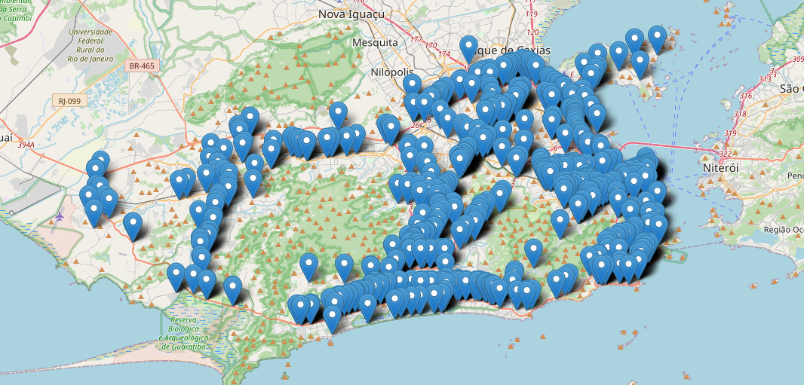
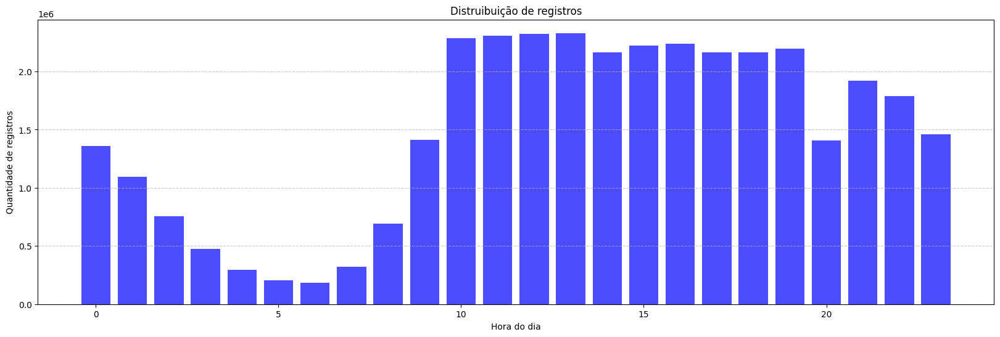
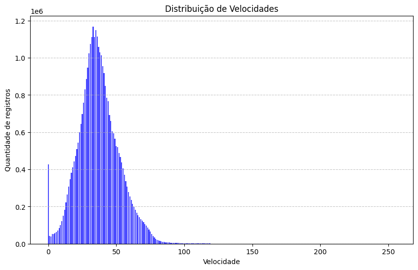

# Desafio CIVITAS

A maior parte das análises foi feita em python, num notebook. Aqui deixarei as querys que estarei utilizando,
o código completo de cada análise pode ser encontrado no notebook que está no repositório.

## 1. Análise exploratória

### 1.1 Query inicial
Primeiramente, vamos fazer uma query que retorne todos os dados para termos um primeiro contato com o banco.

```sql
select 
    * 
from 
    rj-cetrio.desafio.readings_2024_06
```

Como resultado, temos:


Podemos ver que os dados que estavam no formato de byte foram traduzidos para base64 pelo Big query,
utilizando python, tentei decodificar os bytes em algum outro formato que tornasse legível as informações,
porém não foi possivel. Essa pode ser considerada uma inconsistência, uma vez que não é possivel identificar
com clareza o que os dados querem dizer. Para manter a consistência com o Big Query, nos códigos em python irei
tratar também os bytes em base 64.As análises estão sendo feitas a sua maioria num notebook python.

### 1.2 Analisando Nulls

Vamos agora, procurar por valores nulos que podem prejudicar a análise.

```sql
select
    count (case when placa is null then 1 end) as null_placa,
    count (case when datahora is null then 1 end) as null_datahora,
    count (case when camera_latitude is null then 1 end) as null_camera_latitude,
    count (case when camera_longitude is null then 1 end) as null_camera_longitude,
    count (case when datahora_captura is null then 1 end) as null_datahora_captura
from
    rj-cetrio.desafio.readings_2024_06;
```

Temos então:


Podemos observar que somente a coluna datahora_captura possui valores nulos. Como ja temos a informação da datahora em outra coluna
essa coluna pode ser desconsiderada, visto que além de não estar com valores completos, não adiciona nenhuma informação realmente
importante para a análise da clonagem das placas.

### 1.3 Analisando as câmeras


Agora, vamos analisar as câmeras e suas localizações.

```sql
select
    to_base64(camera_numero) as cameras,
    camera_latitude as lat,
    camera_longitude as long,
    count(*) as numero_registros
from
    `rj-cetrio.desafio.readings_2024_06`
group by
    cameras, lat, long
order by
    numero_registros desc;
```

Com essa query, temos o seguinte resultado:


Como estamos vendo, existem diversos registros de uma câmera na latitude 0 e longitude 0 , o que é um erro. Para explorar melhor, 
vamos plotar a distribuição das câmeras num mapa utilizando a lib folium.

Temos então, o resultado:


Podemos ver que além da camera na latitude e longitude 0 , temos diversas outras que estão fora dos limites do próprio Brasil,
aproximando um pouco o mapa, temos:


Dessa imagem, podemos traçar um retângulo que isole as cameras do nosso interesse, eu optei pelas coordenadas:

```
Topo superior direito
Latitude : -22.767821
Longitude : -43.152521

Canto inferior esquerdo
Latitude : -23.100466
Longitude : -43.807011

```

A partir de agora, vamos utilizar uma CTE em todas as querys para sempre retornar registros apenas das câmeras dentro do território de interesse.
Refazendo a query e replotando o mapa, mas agora com a CTE, temos:

```sql
with radares_filtrados as (
    select *
    from `rj-cetrio.desafio.readings_2024_06`
    where camera_latitude between -23.100466 and -22.767821
      and camera_longitude between -43.807011 and -43.152521
)
select
    to_base64(camera_numero) as cameras,
    camera_latitude as lat,
    camera_longitude as long,
    count(*) as numero_registros
from
    radares_filtrados
group by
    cameras, lat, long
order by
    numero_registros desc;
```

Verificando o resultado:



Podemos agora, começar a analisar as cameras que interessam.
Vamos agora, fazer um plot de mapa de calor para identificar onde mais registros estão sendo feitos,
essa análise ajuda a identificar lugares com transito mais intenso.

```sql
with radares_filtrados as (
    select *
    from `rj-cetrio.desafio.readings_2024_06`
    where camera_latitude between -23.100466 and -22.767821
      and camera_longitude between -43.807011 and -43.152521
)
select
    to_base64(camera_numero) as cameras,
    camera_latitude as lat,
    camera_longitude as long,
    count(*) as numero_registros
from
    radares_filtrados
group by
    cameras, lat, long
order by
    numero_registros desc;
```

Como resultado, temos:


Conseguimos ver claramente que o trânsito é mais intenso nas regiões Norte e Sul, além de uma concentração
na região da Barra da Tijuca e Barra Olímpica.


Uma outra análise que pode ser feita é da hora em que cada registro é feita, dessa forma
podemos identificar os horarios de pico no trânsito. Vamos então fazer uma nova query para
obter esses dados. Além da quantidade de registros, também podemos ver a velocidade média
em cada horário.

```sql
with radares_filtrados as (
    select *
    from `rj-cetrio.desafio.readings_2024_06`
    where camera_latitude between -23.100466 and -22.767821
      and camera_longitude between -43.807011 and -43.152521
)
select
    extract(hour from datahora) as hora,
    count(*) as quantidade_registros,
    avg(velocidade) as velocidade_media,
from  
    radares_filtrados
group by
    hora
order by
    hora;
```

Dessa forma, podemos verificar quais são os horários de pico e ver a distruibuição dos registros,
além de notar se o fluxo está melhor ou pior dependendo da velocidade média.




O padrão é esperado, visto que o fluxo de registro é bem menor de noite e de manhã, além disso,
podemos ver que a velocidade média é maior nos horarios com menos registros, o que de fato faz sentido
visto que o trânsito estaria mais livre. Outro dado que podemos obter é a velocidade média máxima e mínima
nos horários estipulados. Tivemos então a velocidade média máxima de ```44 km/hr``` e a mínima de ```33 km/hr```.

### 1.4 Analisando a quantidade de placas

Agora, vamos analisar os dados sobre as placas. Vamos contar quantas placas registradas existem.

```sql
with radares_filtrados as (
    select *
    from `rj-cetrio.desafio.readings_2024_06`
    where camera_latitude between -23.100466 and -22.767821
      and camera_longitude between -43.807011 and -43.152521
)
select
  count(distinct placa) as numero_placas
from
  radares_filtrados
```

Temos ``` 7863888 ``` como resultado, quase 8 milhões. Agora, vamos separar o número de placas por tipo de veículo.

```sql
with radares_filtrados as (
    select *
    from `rj-cetrio.desafio.readings_2024_06`
    where camera_latitude between -23.100466 and -22.767821
      and camera_longitude between -43.807011 and -43.152521
)
select
    to_base64(tipoveiculo) as tipoveiculo,
    count(distinct placa) as quantidade
from
    radares_filtrados
group by
    tipoveiculo;
```

O número total de placas deve ser igual a soma da quantidade de placas distintas de cada tipo de veiculo.
Somando todos cada tipo de veículo, temos ``` 8373934 ``` o que excede o total de placas distintas,isso é
um indicador que existem veiculos distintos com a mesma placa, o que caracteriza uma clonagem.
Temos então, pelo menos ``` 510046 ``` placas sendo usadas por veiculos distintos.


### 1.5 Analisando a velocidade

Vamos agora identificar as velocidades média , máxima e mínima dos registros, além da sua distribuição.


```sql
with radares_filtrados as (
    select *
    from `rj-cetrio.desafio.readings_2024_06`
    where camera_latitude between -23.100466 and -22.767821
      and camera_longitude between -43.807011 and -43.152521
)
select
    avg(velocidade) as velocidade_media,
    max(velocidade) as velocidade_maxima,
    min(velocidade) as velocidade_minima
from
    radares_filtrados;
```
Temos então:

```
Velocidade mínima : 0 km/hr
Velocidade média : 37 km/hr
Velocidade máxima : 255 km/hr

```
Agora, para sabermos a distribuição das velocidades,temos:

```sql
with radares_filtrados as (
    select *
    from `rj-cetrio.desafio.readings_2024_06`
    where camera_latitude between -23.100466 and -22.767821
      and camera_longitude between -43.807011 and -43.152521
)
select
    velocidade,
    count(*) as quantidade
from
    radares_filtrados
group by
    velocidade
order by
    velocidade asc;
```

O que nos dá uma distribuição da seguinte forma:



Podemos observar que existe uma quantidade muito grande de registros com 0 km/hr, o que pode indicar um erro de registro ou funcionamento do radar.w
Essa quantidade de 0's pode estar prejudicando a velocidade média. Vamos então, excluir os 0's e para ver como fica a nova média.


```sql
with radares_filtrados as (
    select *
    from `rj-cetrio.desafio.readings_2024_06`
    where camera_latitude between -23.100466 and -22.767821
      and camera_longitude between -43.807011 and -43.152521
      and velocidade <> 0
)
select
    avg(velocidade) as velocidade_media,
    max(velocidade) as velocidade_maxima,
    min(velocidade) as velocidade_minima
from
    radares_filtrados;
```
Como resultado, temos:

```
Velocidade mínima : 1 km/hr
Velocidade média : 37 km/hr
Velocidade máxima : 255 km/hr

```
A velocidade média não alterou significativamente. Então as análises de velocidade média ja feitas serão válidas ainda,
mas para a query de placas clonadas, teremos que ter atenção em relação à esses registros, pois eles provavelmente indicam
algum erro de medida.


## 2. Identificação de placas clonadas

Para a query das placas clonadas existem algumas abordagens que podem ser feitas.

### 2.1 Primeira abordagem

Para a primeira abordagem, iremos procurar por registros da mesma placa no mesmo momento em lugares diferentes.
Dessa forma, temos quase certeza que o caso é de clonagem. Para essa query, irei analisar esse casa para 
placas dectectadas no mesmo momento e que estavam numa distância de no mínimo 1km. Essa distância está sendo 
arbitrada, se supormos que a localização e a data hora do registro são precisos, qualquer distância significativa
deveria ser indicativo de clonagem, porém estou optando por 1km, mas poderia ser 5km , 10km.

Como essa query é maior, utilizei o Big Query diretamente e não o notebook python.

```sql
with radares_filtrados as (
    select *
    from `rj-cetrio.desafio.readings_2024_06`
    where camera_latitude between -23.100466 and -22.767821
      and camera_longitude between -43.807011 and -43.152521
)

select
    a.placa,
    a.datahora,
    a.camera_latitude as latitude_a,
    a.camera_longitude as longitude_a,
    b.camera_latitude as latitude_b,
    b.camera_longitude as longitude_b,
    -- Calcula a distância em quilômetros entre os dois registros
    st_distance(st_geogpoint(a.camera_longitude, a.camera_latitude), st_geogpoint(b.camera_longitude, b.camera_latitude)) / 1000 as distancia_km
from
    radares_filtrados a
join
    radares_filtrados b
on
    a.placa = b.placa
    and a.datahora = b.datahora
    and (a.camera_latitude != b.camera_latitude or a.camera_longitude != b.camera_longitude)
    and st_distance(st_geogpoint(a.camera_longitude, a.camera_latitude), st_geogpoint(b.camera_longitude, b.camera_latitude)) / 1000 >= 1
order by
    a.placa, a.datahora;
```

Como resultado, temos:


Temos então, diversas placas com registros no mesmo momento e em lugares extremamente afastados e no mesmo instante, o que é um indicativo 
muito grande de clonagem.


### 2.1 Segunda abordagem


Para a segunda abordagem, vamos analisar registros que estão em momentos próximos, mais especificamente consecutivos
de forma que seja inviável que tenha sido feito pelo mesmo carro. Se os registros indicam que o veículo se moveu de 
maneira rápida demais, pode indicar que eram veículos diferentes e, portanto, uma clonagem. Para essa abordagem 
se o carro for mais rapido de 255 km/hr entre um trecho e outro, vamos tratar como clonagem. Essa velocidade
é escolhida por ser a maior medida pelo radar , e dar uma confiança maior. Porém, como é a velocidade média é de 37 km/hr
muito provavelmente, existem casos que não foram mapeados aqui, porém diminuir a velocidade de comparação também diminui
a certeza dos resultados.

```sql
with radares_filtrados as (
    select *,
           lead(datahora) over (partition by placa order by datahora) as proxima_datahora,
           lead(camera_latitude) over (partition by placa order by datahora) as proxima_camera_latitude,
           lead(camera_longitude) over (partition by placa order by datahora) as proxima_camera_longitude
    from `rj-cetrio.desafio.readings_2024_06`
    where camera_latitude between -23.100466 and -22.767821
      and camera_longitude between -43.807011 and -43.152521
    order by placa, datahora
)

select distinct
    camera_numero,
    placa,
    datahora,
    proxima_datahora,
    velocidade_media_kmh
from (
    select
        camera_numero,
        placa,
        datahora,
        camera_latitude,
        camera_longitude,
        velocidade,
        proxima_datahora,
        proxima_camera_latitude,
        proxima_camera_longitude,
        -- Calcula a distância em quilômetros entre registros consecutivos
        st_distance(st_geogpoint(camera_longitude, camera_latitude), st_geogpoint(proxima_camera_longitude, proxima_camera_latitude)) / 1000 as distancia_km,
        -- Calcula a diferença de tempo em segundos entre registros consecutivos
        timestamp_diff(proxima_datahora, datahora, second) as diff_segundos,
        -- Calcula a velocidade média entre registros consecutivos (em km/h)
        case
            when timestamp_diff(proxima_datahora, datahora, second) > 0
            then (st_distance(st_geogpoint(camera_longitude, camera_latitude), st_geogpoint(proxima_camera_longitude, proxima_camera_latitude)) / 1000) / 
                 (timestamp_diff(proxima_datahora, datahora, second) / 3600)
            else null  -- Evita a divisão por zero
        end as velocidade_media_kmh
    from radares_filtrados
) as velocidades
where velocidade_media_kmh > 255;

```