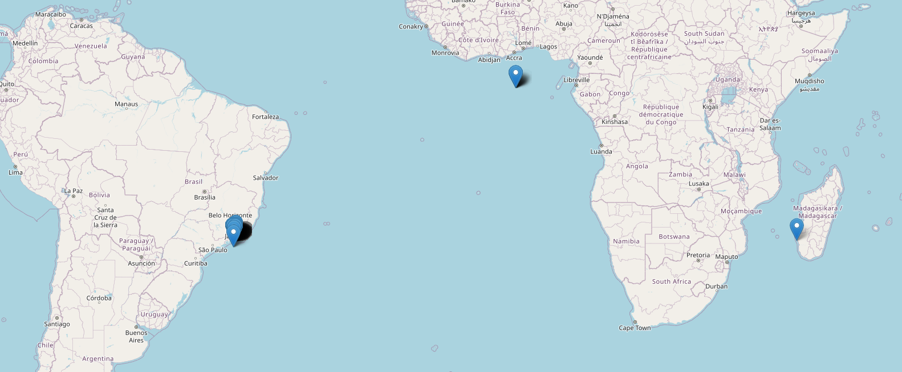

# Desafio CIVITAS

## 1. Análise exploratória

Primeiramente, vamos fazer uma query que retorne todos os dados para termos um primeiro contato com o banco.

```sql
select 
    * 
from 
    rj-cetrio.desafio.readings_2024_06
```

Como resultado, temos:


Podemos ver que os dados que estavam no formato de byte foram traduzidos para base64 pelo Big query,
utilizando python, tentei decodificar os bytes em algum outro formato que tornasse legível as informações,
porém não foi possivel. Essa pode ser considerada uma inconsistência, uma vez que não é possivel identificar
com clareza o que os dados querem dizer. Para manter a consistência com o Big Query, nos códigos em python irei
tratar também os bytes em base 64.As análises estão sendo feitas a sua maioria num notebook python.

Vamos agora, procurar por valores nulos que podem prejudicar a análise.

```sql
select
    count (case when placa is null then 1 end) as null_placa,
    count (case when datahora is null then 1 end) as null_datahora,
    count (case when camera_latitude is null then 1 end) as null_camera_latitude,
    count (case when camera_longitude is null then 1 end) as null_camera_longitude,
    count (case when datahora_captura is null then 1 end) as null_datahora_captura
from
    rj-cetrio.desafio.readings_2024_06;
```

Temos então:


Podemos observar que somente a coluna datahora_captura possui valores nulos. Como ja temos a informação da datahora em outra coluna
essa coluna pode ser desconsiderada, visto que além de não estar com valores completos, não adiciona nenhuma informação realmente
importante para a análise da clonagem das placas.


Agora, vamos analisar as câmeras e suas localizações.

```sql
select
    to_base64(camera_numero) as cameras,
    camera_latitude as lat,
    camera_longitude as long,
    count(*) as numero_registros
from
    `rj-cetrio.desafio.readings_2024_06`
group by
    cameras, lat, long
order by
    numero_registros desc;
```

Com essa query, temos o seguinte resultado:


Como estamos vendo, existem diversos registros de uma câmera na latitude 0 e longitude 0 , o que é um erro. Para explorar melhor, 
vamos plotar a distribuição das câmeras num mapa utilizando o lib folium.

```python

import pandas as pd
import numpy as np
import matplotlib.pyplot as plt
import basedosdados as bd
import folium
import chardet

query = '''
select
    to_base64(camera_numero) as cameras,
    camera_latitude as lat,
    camera_longitude as long,
    count(*) as numero_registros
from
    `rj-cetrio.desafio.readings_2024_06`
group by
    cameras, lat, long
order by
    numero_registros desc;
'''

df = bd.read_sql(query, billing_project_id="atomic-oven-387211")

# Criar um mapa centrado nas coordenadas médias
mapa = folium.Map(location=[df['lat'].mean(), df['long'].mean()], zoom_start=12)

# Adicionar marcadores ao mapa
for index, row in df.iterrows():
    folium.Marker([row['lat'], row['long']], popup=row['cameras']).add_to(mapa)

# Exibir o mapa
mapa
```

Temos então, o resultado:



Podemos ver que além da camera na latitude e longitude 0 , temos diversas outras que estão fora dos limites do próprio Brasil,
aproximando um pouco o mapa, temos:


Dessa imagem, podemos traçar um retângulo que isole as cameras do nosso interesse, eu optei pelas coordenadas:

```
Topo superior direito
Latitude : -22.767821
Longitude : -43.152521

Canto inferior esquerdo
Latitude : -23.100466
Longitude : -43.807011

```

A partir de agora, vamos utilizar uma CTE em todas as querys para sempre retornar registros apenas das câmeras dentro do território de interesse.
Refazendo a query e replotando o mapa, mas agora com a CTE, temos:

```sql
with radares_filtrados as (
    select *
    from `rj-cetrio.desafio.readings_2024_06`
    where camera_latitude between -23.100466 and -22.767821
      and camera_longitude between -43.807011 and -43.152521
)
select
    to_base64(camera_numero) as cameras,
    camera_latitude as lat,
    camera_longitude as long,
    count(*) as numero_registros
from
    radares_filtrados
group by
    cameras, lat, long
order by
    numero_registros desc;
```

Verificando o resultado:


Podemos agora, começar a analisar as cameras que interessam.
Vamos agora, fazer um plot de mapa de calor para identificar onde mais registros estão sendo feitos,
essa análise ajuda a identificar lugares com transito mais intenso.

```python
query = '''
with radares_filtrados as (
    select *
    from `rj-cetrio.desafio.readings_2024_06`
    where camera_latitude between -23.100466 and -22.767821
      and camera_longitude between -43.807011 and -43.152521
)
select
    to_base64(camera_numero) as cameras,
    camera_latitude as lat,
    camera_longitude as long,
    count(*) as numero_registros
from
    radares_filtrados
group by
    cameras, lat, long
order by
    numero_registros desc;
'''

df = bd.read_sql(query, billing_project_id="atomic-oven-387211")

center_lat = np.mean(df['lat'])  # lat central para o centro do mapa
center_long = np.mean(df['long'])  # long central para o centro do mapa
m = folium.Map(location=[center_lat, center_long], zoom_start=12)

# Converter DataFrame para uma lista de listas para ser usada no HeatMap
heat_data = [[row['lat'], row['long'], row['numero_registros']] for index, row in df.iterrows()]

# Adicionar o HeatMap ao mapa
HeatMap(heat_data).add_to(m)

```

Como resultado, temos:

